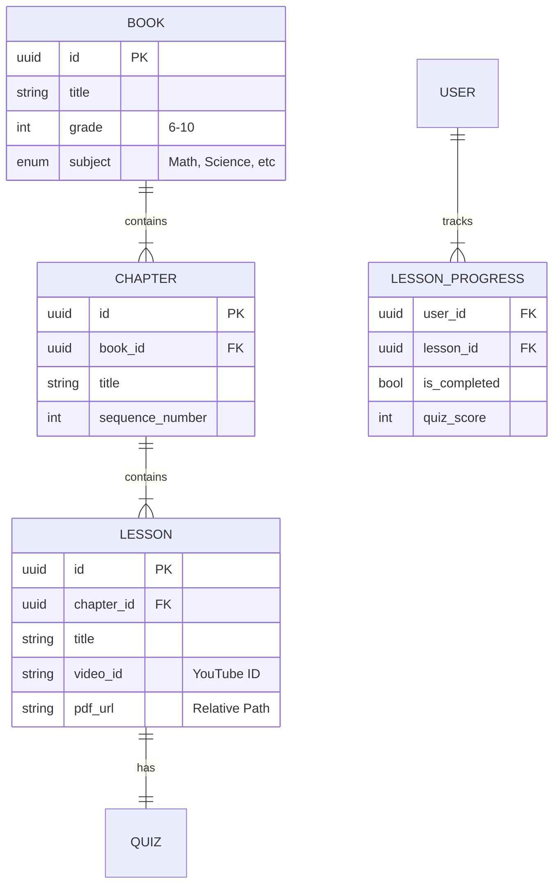

Here is the clean, copy-pasteable content for your `docs/ARCHITECTURE.md` file.

```markdown
# Technical Architecture: Tutor App (Smart Stack)

**Version:** 1.0  
**Maintainer:** Technical Architect  
**Status:** Active Development

---

## 1. High-Level Architecture
The system follows a **Monolithic Service-Oriented Architecture** designed for high concurrency on low-cost infrastructure.

### **Tech Stack**
- **Frontend:** Flutter (Dart 3.x) - *Cross-platform Mobile & Web*.
- **Backend:** FastAPI (Python 3.11+) - *Asynchronous REST API*.
- **Database:** PostgreSQL 15 - *Relational Data Store*.
- **Infrastructure:** Docker Compose (Local) / Coolify (Production VPS).
- **Media Strategy:** Decoupled Storage.
  - Video -> YouTube (Streaming).
  - PDFs -> Local VPS Storage / Nginx Static Serving.

### **System Context Diagram**
```mermaid
graph TD
    subgraph "Client Layer"
        FlutterApp[Flutter App<br/>(Android/iOS)]
    end

    subgraph "Content Delivery Network"
        YT[YouTube<br/>(Video Streaming)]
    end

    subgraph "Server Layer (Docker Network)"
        LB[Reverse Proxy<br/>(Coolify/Traefik)]
        API[FastAPI Backend<br/>Port: 8000]
        DB[(PostgreSQL 15<br/>Port: 5432)]
    end

    %% Interactions
    FlutterApp -- "1. REST API (JSON)" --> LB
    LB -- "Proxy" --> API
    API -- "2. AsyncPG (Binary)" --> DB
    
    %% Media Bypass
    FlutterApp -- "3. Direct Stream" --> YT

```

---

## 2. Codebase Structure (Monorepo)

The project is organized as a unified repository to maintain context across the stack.

```text
/tutor-monorepo
├── .env                  # Root secrets (GitIgnored)
├── docker-compose.yml    # Orchestration service definition
├── docs/                 # Documentation (PRD, Architecture)
│   ├── ARCHITECTURE.md
│   └── PRD.md
├── backend/              # FastAPI Application
│   ├── main.py           # App Entrypoint
│   ├── config.py         # Pydantic Settings
│   ├── Dockerfile        # Backend Container
│   ├── requirements.txt  # Dependencies
│   └── models/           # SQLModel Definitions
│       ├── user.py
│       └── content.py    # Books, Chapters, Lessons
└── frontend/             # Flutter Application (Future)

```

---

## 3. Database Design (Schema)

We use **SQLModel** (SQLAlchemy + Pydantic) for ORM.

### **Entity Relationship Diagram (ERD)**



---

## 4. Implementation Guidelines (The "Rules")

These rules are strict constraints for any AI agent or developer working on this codebase.

### **A. Async-First Database Access**

* **Constraint:** All database interactions must use `async`/`await`.
* **Driver:** Must use `asyncpg`.
* **Pattern:**
```python
# CORRECT
async with engine.begin() as conn:
    await conn.execute(statement)

# INCORRECT
with engine.connect() as conn:
    conn.execute(statement)

```


### **B. Configuration & Security**

* **Settings:** Use `backend/config.py` with `pydantic-settings`.
* **Passwords:** Must be URL-encoded using `urllib.parse.quote_plus` before being passed to the engine.
* **Network:** The Database container must NOT expose ports to the host machine in production (remove `ports: - 5432:5432` in prod).

### **C. Resilience**

* **Healthchecks:** Both Database and Backend must implement Docker healthchecks.
* **Restart Policy:** Use `restart: unless-stopped`.

---

## 5. Development Workflow

### **Local Start**

1. **Environment:** Ensure `.env` exists in root.
2. **Build & Run:**
```bash
docker compose up --build

```


3. **Access:**
* API Docs: `http://localhost:8000/docs`
* Health: `http://localhost:8000/health`


### **Migration Strategy**

* **Current:** `SQLModel.metadata.create_all` (Auto-create on startup).
* **Future:** Alembic for versioned migrations (Phase 3).

```

```