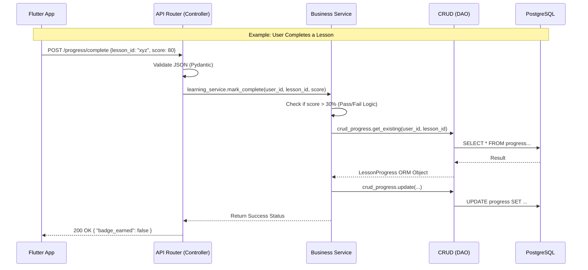

# Product Requirement Document (PRD): Tutor App & LMS (School Edition)

**Version:** 2.1 (Class 10 Edition)
**Status:** Active Development
**Tech Stack:** "Smart Stack" (Flutter + FastAPI Async + PostgreSQL)

## 1. Executive Summary
The Tutor App is a digital companion for school students (Class 6-10) that simplifies the NCERT syllabus. It transforms textbooks into a structured "Game of Completion," where watching a concept video and solving a quiz feels like clearing a level.

**Core Philosophy:** "Zero-Cost Delivery, Gamified Mastery."
* **Heavy Media (Videos):** Hosted on YouTube (Bandwidth Cost: $0).
* **Static Media (PDFs):** Hosted on VPS/Nginx (Bandwidth Cost: Negligible).
* **Logic:** Async FastAPI (High Scale, Low Cost).

## 2. User Personas
**Persona A: The School Student (Class 10)**
* **Goal:** Score 90%+ in Board Exams covering Science, Math, Social Science.
* **Flow:** Select "Class 10 Science" -> Tap "Light" -> Watch Video -> Take Quiz -> Get "Green Tick".

**Persona B: The Content Admin**
* **Goal:** Map existing YouTube videos to the NCERT Chapter list.
* **Flow:** Create "Lesson" -> Paste YouTube Link -> Attach PDF.

## 3. Technical Architecture
* **Frontend:** Flutter (Mobile/Web).
* **Backend:** FastAPI (Async Python 3.11+).
* **Database:** PostgreSQL 15 (Dockerized).
* **Driver:** AsyncPG (Mandatory).
* **Security:** DB Passwords URL-encoded; Port 5432 isolated.

## 4. Database Schema Strategy (SQLModel)

### A. Core Hierarchy
1.  **Book** (e.g., "Science Class 10")
    * `id`: UUID (PK)
    * `title`: String
    * `grade`: Int (6-10)
    * `subject`: String
    * `cover_image`: String

2.  **Chapter** (e.g., "Chemical Reactions")
    * `id`: UUID (PK)
    * `book_id`: UUID (FK -> Book)
    * `sequence_number`: Int
    * `title`: String

### B. Content Layer
3.  **Lesson** (e.g., "Balancing Equations")
    * `id`: UUID (PK)
    * `chapter_id`: UUID (FK -> Chapter)
    * `title`: String
    * `video_id`: String (YouTube ID)
    * `pdf_url`: String (File Path)
    * `duration_seconds`: Int

4.  **Quiz**
    * `id`: UUID (PK)
    * `lesson_id`: UUID (FK -> Lesson)
    * `questions_json`: JSON

### C. User Progress
5.  **LessonProgress**
    * `user_id`: UUID (FK -> User)
    * `lesson_id`: UUID (FK -> Lesson)
    * `is_completed`: Boolean
    * `quiz_score`: Int

To reach the "Industry Standard" level of Low-Level Design (LLD), we need to define the **API Contract** before writing a single line of code. This prevents the classic "Frontend waiting for Backend" deadlock and helps Cursor generate precise Pydantic schemas.

Add this new section to the bottom of your **`docs/ARCHITECTURE.md`** file.

---

### **6. API Interface Design (LLD)**

This section defines the strict JSON contracts for communication between Flutter and FastAPI.

#### **A. Authentication Module**

* **Base URL:** `/api/v1/auth`

| Method | Endpoint | Description | Request Body | Response (200 OK) |
| --- | --- | --- | --- | --- |
| `POST` | `/login` | Email/Password exchange | `{ "username": "email", "password": "..." }` | `{ "access_token": "jwt...", "token_type": "bearer" }` |
| `GET` | `/me` | Get current user profile | *Header: Bearer Token* | `{ "id": "uuid", "email": "...", "role": "student" }` |

#### **B. Content Module (Read-Only)**

* **Base URL:** `/api/v1/content`

**1. Get All Books**

* **Endpoint:** `GET /books`
* **Response:**
```json
[
  {
    "id": "uuid-1",
    "title": "Science Class 10",
    "grade": 10,
    "subject": "science",
    "cover_image": "https://..."
  }
]

```


**2. Get Book Hierarchy (Book -> Chapters -> Lessons)**

* **Endpoint:** `GET /books/{book_id}/structure`
* **Purpose:** Pre-fetch the syllabus tree to display the "Index Page" in Flutter.
* **Response:**
```json
{
  "book_id": "uuid-1",
  "chapters": [
    {
      "id": "uuid-c1",
      "title": "Chemical Reactions",
      "sequence": 1,
      "lessons": [
        {
          "id": "uuid-l1",
          "title": "Balancing Equations",
          "is_free": true,
          "duration": 600
        }
      ]
    }
  ]
}

```


**3. Get Lesson Details (The "Player" View)**

* **Endpoint:** `GET /lessons/{lesson_id}`
* **Auth Required:** Yes (Check subscription/permissions).
* **Response:**
```json
{
  "id": "uuid-l1",
  "title": "Balancing Equations",
  "video_id": "dQw4w9WgXcQ",  // YouTube ID
  "pdf_url": "/static/science10/ch1/notes.pdf",
  "quiz": {
    "id": "uuid-q1",
    "questions": [...] // Full JSON for Flutter Quiz Widget
  }
}

```


#### **C. Progress Module (Write-Heavy)**

* **Base URL:** `/api/v1/progress`

**1. Sync Progress (Upsert)**

* **Endpoint:** `POST /sync`
* **Purpose:** Updates the server when a user finishes a video or quiz.
* **Request Body:**
```json
{
  "lesson_id": "uuid-l1",
  "is_watched": true,
  "quiz_score": 85  // Optional, only if quiz taken
}

```


* **Response:** `{ "status": "updated", "mastery_level": "gold" }`

---

### **How this completes your "Standard":**

1. **HLD (Architecture):** Tells us *User* talks to *Backend* via *JSON*.
2. **LLD (API Contract):** Tells us exactly *what* that JSON looks like (`video_id` string, `quiz_score` int).
3. **PRD (Requirements):** Tells us *why* we need a `quiz_score` (User Persona A needs to see progress).

### **Your Next Move (Cursor Prompt)**

Now that your LLD is documented, you can run this prompt to generate the API schemas perfectly:

> "Reference the **API Interface Design** section in `docs/ARCHITECTURE.md`. Create the Pydantic schemas in `backend/schemas/api_models.py` that match these JSON structures exactly."

This ensures your Flutter team (or you, later) knows exactly what to parse without ever looking at the backend Python code. This is how large teams decouple their work.


## 7. Software Design Patterns (The 3-Tier Architecture)

To maintain industry-standard separation of concerns, the backend strictly follows the **Controller-Service-Repository (CSR)** pattern.

### **A. Layer Definitions**

| Layer | Java/Spring Equivalent | FastAPI Component | Responsibility | Constraints |
| --- | --- | --- | --- | --- |
| **Presentation** | Controller | **Router** (`api/routes`) | Handles HTTP Request/Response, Input Validation (Pydantic), and Dependency Injection. | **NO** SQL queries.<br>

<br>**NO** business logic.<br>

<br>Must return Pydantic Schemas (DTOs). |
| **Business** | Service | **Service** (`services/`) | Contains the core business rules (e.g., "Calculate Quiz Score", "Grant Badge"). Orchestrates multiple CRUD operations. | **NO** HTTP definitions (e.g., don't import `HTTPException`).<br>

<br>Should be pure Python logic. |
| **Data Access** | DAO / Repository | **CRUD** (`crud/`) | Handles direct database interactions (SELECT, INSERT, UPDATE). Abstraction over SQLModel/SQLAlchemy. | **NO** business logic.<br>

<br>Must return ORM Models (Entities). |

### **B. Directory Structure (LLD)**

The `backend/` folder must be organized to reflect these layers:

```text
backend/
├── main.py                  # App Entrypoint
├── config.py                # Pydantic Settings
├── models/                  # [Entities] Database Tables (SQLModel)
│   ├── user.py
│   └── content.py
├── schemas/                 # [DTOs] API Request/Response Models
│   ├── auth_schema.py
│   └── content_schema.py
├── crud/                    # [DAO Layer] Raw Database Access
│   ├── base.py              # Generic CRUD helpers (Optional)
│   ├── crud_user.py
│   └── crud_content.py
├── services/                # [Service Layer] Business Logic
│   ├── auth_service.py
│   └── learning_service.py
└── api/                     # [Controller Layer] Routes
    ├── deps.py              # Dependency Injection (get_db, current_user)
    └── v1/
        ├── auth.py
        └── content.py

```

### **C. Data Flow Diagram**



### **D. Implementation Rules for Developers**

1. **Dependency Injection:**
* Routers must inject the `AsyncSession` using `Depends(get_db)`.
* Services should accept the `session` as an argument in their methods.


2. **DTOs vs ORMs:**
* **Router** receives a Schema (DTO) and passes data to Service.
* **CRUD** returns an ORM Object (Database Row) to Service.
* **Service** converts ORM Object  Schema (DTO) before sending it back to Router.


3. **Atomic Transactions:**
* Business logic requiring multiple DB writes (e.g., "Finish Quiz" + "Update Leaderboard") must happen inside a single Service method to ensure transactional integrity.

## 8. Frontend Architecture (Flutter)

The mobile client follows a **Feature-First, Clean Architecture** pattern using Riverpod 2.0.

### **A. Directory Structure**
- `src/features/` - Contains all business logic, grouped by domain (Auth, Content, Quiz).
- `src/common_widgets/` - Shared UI components (Buttons, Inputs).
- `src/utils/` - Pure functions (Date formatters).

### **B. Layer Responsibilities**
1.  **Data Layer (`/data`)**:
    - **Repositories:** Interact with FastAPI via `Dio`.
    - **DTOs:** Data Transfer Objects defined using `Freezed`.
2.  **Domain Layer (`/domain`)**:
    - **Entities:** Pure, immutable Dart classes representing the business objects.
3.  **Presentation Layer (`/presentation`)**:
    - **Controllers:** `AsyncNotifier` providers that manage state (Loading/Error/Data).
    - **Screens:** `ConsumerWidget` classes that watch providers and rebuild UI.

### **C. State Management Strategy**
- **Library:** Riverpod (with `riverpod_generator`).
- **Pattern:** `AsyncValue` is used for all async operations to strictly handle Loading and Error states in the UI.


